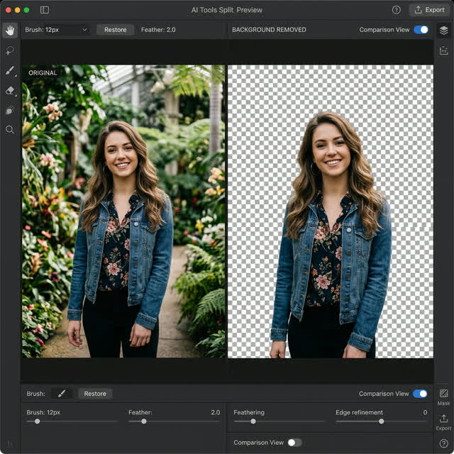

# ✨ AI Image Background Remover

[](https://www.python.org/downloads/)
[](https://opensource.org/licenses/MIT)
[](https://github.com/danielgatis/rembg)

A professional, high-performance Python CLI tool that removes backgrounds from images with surgical precision using AI. No API keys required, works entirely offline!



## 🚀 Features

- **High Precision:** Powered by `rembg` (U2-Net) for industry-standard background removal.
- **Batch Processing:** Remove backgrounds from 100+ images in seconds.
- **Format Support:** Works with `.png`, `.jpg`, `.jpeg`, and `.webp`.
- **Transparency Preservation:** Automatically saves output as high-quality `.png` with transparency.
- **Easy CLI:** Simple commands for both single and batch processing.

## 🛠️ Installation

1. **Clone the repository:**
   ```bash
   git clone https://github.com/your-username/image-background-remover.git
   cd image-background-remover
   ```

2. **Install dependencies:**
   ```bash
   pip install "rembg[cpu]" pillow click tqdm
   ```

### 💻 Usage

#### 🏁 Quick Start (Windows)
If you are on Windows, simply double-click `run_windows.bat` and drag-and-drop your image!

#### 🖼️ Single Image Processing
Process a single image via command line:
```bash
python main.py -i input.jpg
```

### 📁 Batch Processing
Process an entire directory of images:
```bash
python main.py -i ./my_images -o ./processed_results
```

## ⚙️ How it Works
This tool utilizes the `rembg` library, which leverages deep learning models to perform semantic segmentation. It identifies the foreground object and intelligently masks the background without needing a green screen or manual intervention.

## 📄 License
Distributed under the MIT License. See `LICENSE` for more information.

---
### 👨‍💻 Developed by
**Lakshan**  
[](https://wa.me/94768855659)

Built with ❤️ for the open-source community.
